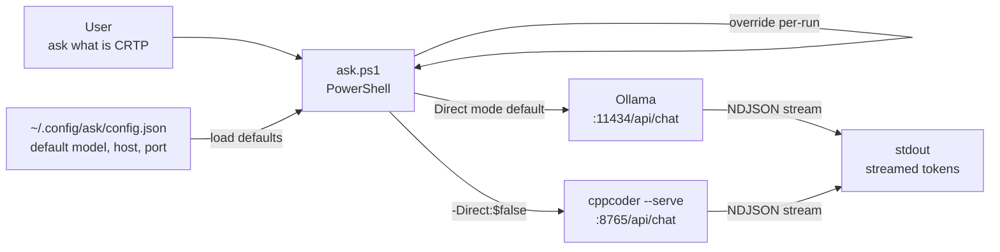
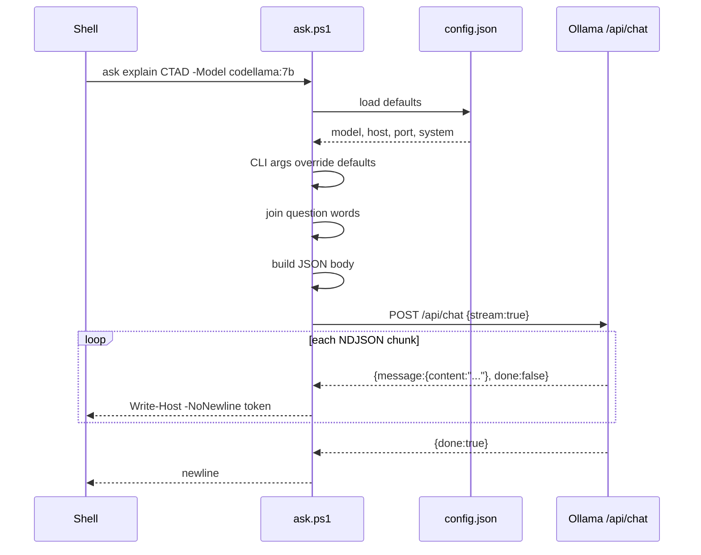
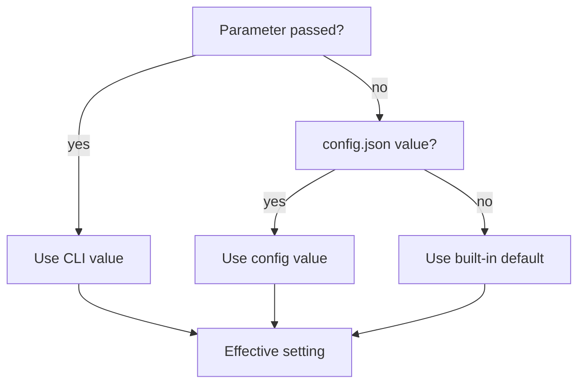

# CppAsk

A minimal PowerShell CLI for asking your local LLM a question from any terminal, without quotes, without a browser, without friction.

Built on top of [CppLocalLlmCodeAssist](https://github.com/cschladetsch/CppLocalLlmCodeAssist) and [Ollama](https://ollama.com).

```powershell
ask what is the rule of five in C++23
ask explain CRTP -Model qwen2.5-coder:7b
ask -SetModel dolphin-8b:latest
```

---

## How it works



### Request lifecycle



### Config resolution



---

## Requirements

- PowerShell 7+
- [Ollama](https://ollama.com) running locally
- At least one model pulled: `ollama pull dolphin-8b:latest`

---

## Install

```powershell
git clone https://github.com/cschladetsch/CppAsk
cd CppAsk
.\install.ps1
```

The installer:

1. Copies `ask.ps1` to `~/bin` (or `-Destination` of your choice)
2. Adds `~/bin` to your user `PATH` permanently
3. Adds a global `ask` function and alias to `$PROFILE`
4. Queries `ollama list` and prompts for config values
5. Writes `~/.config/ask/config.json`
6. Makes `ask` available in the current session immediately

```
  ask installer
  ─────────────────────────────────────────

  Available Ollama models:
    dolphin-8b:latest
    qwen2.5-coder:7b
    codellama:7b
    ...

  Default model       [dolphin-8b:latest]:
  Ollama host         [127.0.0.1]:
  Ollama port         [11434]:
  cppcoder port       [8765]:
  System prompt       []:
```

---

## Usage

```powershell
# No quotes needed
ask what is the rule of five in C++23
ask explain brace elision
ask what does PatchApplier do

# Override model for one run
ask explain CRTP -Model qwen2.5-coder:7b
ask write a merge sort in Rust -Model codellama:7b

# Pipe a question in
"why does CTAD fail here?" | ask

# Add a system prompt for one run
ask summarise this -System "You are a terse technical editor."

# Change the persistent default model
ask -SetModel dolphin-8b:latest
ask -SetModel qwen2.5-coder:7b

# Route via cppcoder --serve instead of Ollama directly
ask what does ResearchEngine do -Direct:$false

# Collect full reply before printing
ask explain templates -NoStream
```

---

## Parameters

| Parameter     | Default              | Description                                              |
|---------------|----------------------|----------------------------------------------------------|
| `Question`    | *(required)*         | Words to ask -- no quotes needed, joined automatically   |
| `-Model`      | from config          | Ollama model tag                                         |
| `-OllamaHost` | `127.0.0.1`          | Ollama hostname                                          |
| `-Port`       | `11434`              | Port -- `11434` for Ollama direct, `8765` for cppcoder   |
| `-Direct`     | `$true`              | Talk straight to Ollama; `$false` routes via cppcoder    |
| `-System`     | from config          | System prompt prepended to every request                 |
| `-NoStream`   | off                  | Buffer full reply before printing                        |
| `-SetModel`   |                      | Persist a new default model to config, then exit         |
| `-NewChat`    | off                  | Clear history, then start a fresh thread with this question |
| `-NoHistory`  | off                  | One-shot -- don't read or write history for this call     |
| `-ClearHistory` |                    | Wipe history and exit, without asking anything            |

---

## Config

`~/.config/ask/config.json` -- created by the installer, edited by `-SetModel`:

```json
{
    "model":       "dolphin-8b:latest",
    "host":        "127.0.0.1",
    "port_direct": 11434,
    "port_serve":  8765,
    "system":      ""
}
```

CLI parameters always override config for that run.

---

## Conversation history

By default, `ask` remembers the conversation. Each call appends your question
and the model's reply to `~/.ask_conversation_state.json`, and prepends
everything from that file (capped at the last 20 exchanges) to the next
request -- so follow-ups like `ask and what about X` actually have the prior
turns as context, same as a chat UI.

```powershell
ask what is CRTP
ask now show an example        # remembers the previous question
ask -NewChat what is CRTP      # starts a fresh thread
ask -NoHistory what is 1+1     # true one-shot, ignores/skips history entirely
ask -ClearHistory              # wipe the thread, don't ask anything
```

---

## Related

- [CppLocalLlmCodeAssist](https://github.com/cschladetsch/CppLocalLlmCodeAssist) -- the full research/edit/chat engine this wraps
- [Ollama](https://ollama.com) -- local model runtime

## License

MIT


