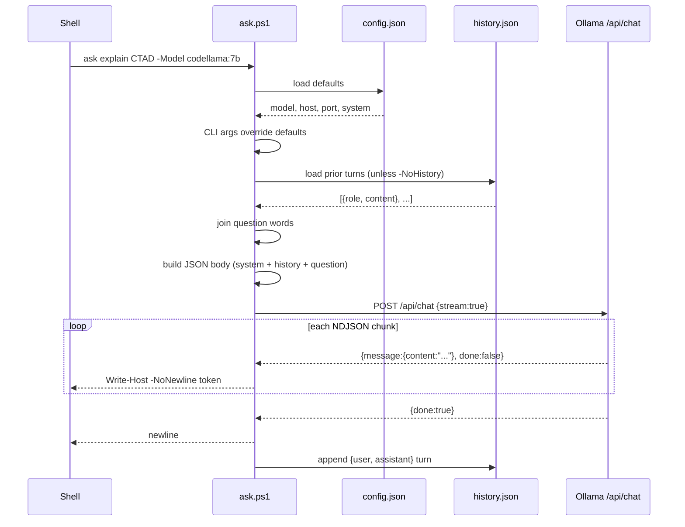
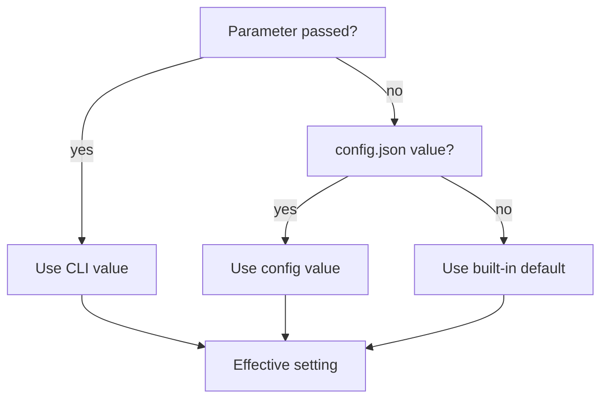
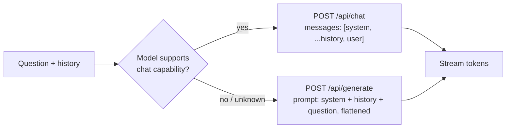
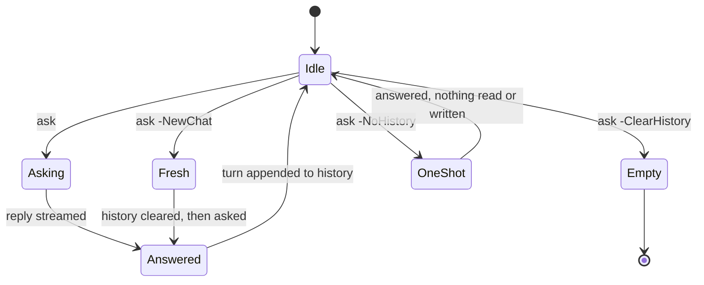
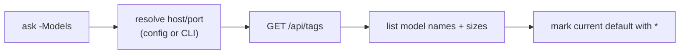

# Architecture

## Request lifecycle

## Config resolution

Every setting follows the same CLI-overrides-config-overrides-default chain:

## Chat vs. generate

Not every model exposes `/api/chat`. `ask.ps1` probes `/api/tags` for the target model's capabilities and falls back to `/api/generate`, flattening any conversation history into the prompt text instead of a messages array:

## Conversation history

By default, `ask` remembers the conversation. Each call appends your question and the model's reply to `~/.ask_conversation_state.json`, capped at the last 20 exchanges (40 messages), and prepends that history to the next request.

## Model listing

`-Models` queries `/api/tags` directly using the same host/port resolution as a normal request, and marks the current configured default:

## Related

- [Overview](.) — install, usage, parameters
