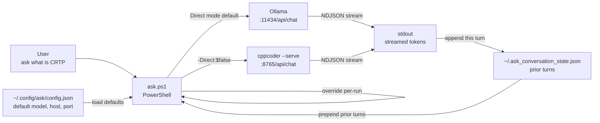

# CppAsk

A minimal PowerShell CLI for asking your local LLM a question from any terminal, without quotes, without a browser, without friction.

Built on top of [CppLocalLlmCodeAssist](https://github.com/cschladetsch/CppLocalLlmCodeAssist) and [Ollama](https://ollama.com).

```powershell
ask what is the rule of five in C++23
ask explain CRTP -Model qwen2.5-coder:7b
ask -SetModel dolphin-8b:latest
ask -Models
```

## How it works



## Requirements

- PowerShell 7+
- [Ollama](https://ollama.com) running locally
- At least one model pulled: `ollama pull dolphin-8b:latest`

## Install

```powershell
git clone https://github.com/cschladetsch/CppAsk
cd CppAsk
.\install.ps1
```

The installer copies `ask.ps1` to `~/bin`, adds it to `PATH`, wires up an `ask` alias in `$PROFILE`, queries `ollama list`, and writes `~/.config/ask/config.json`.

See [Architecture](architecture) for the request lifecycle, config resolution, conversation history, and model listing in detail.

## Related

- [CppLocalLlmCodeAssist](https://github.com/cschladetsch/CppLocalLlmCodeAssist) — the full research/edit/chat engine this wraps
- [Ollama](https://ollama.com) — local model runtime
